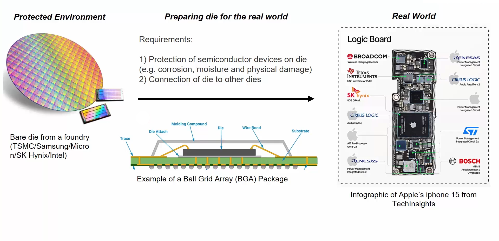
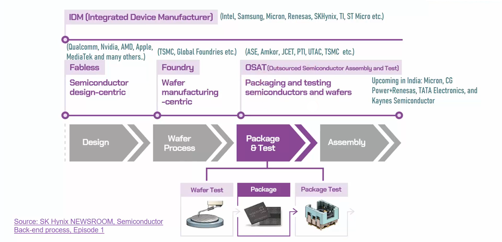
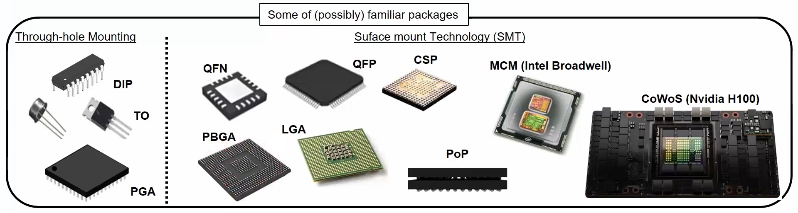
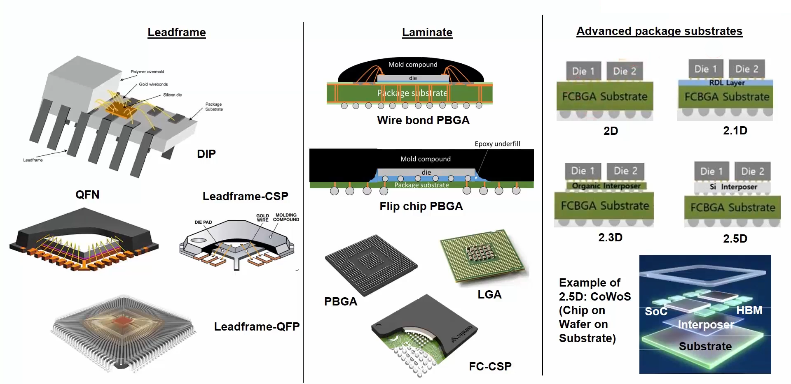
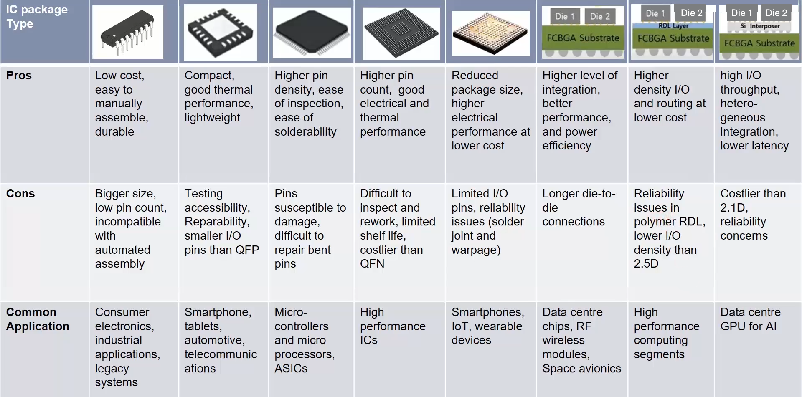
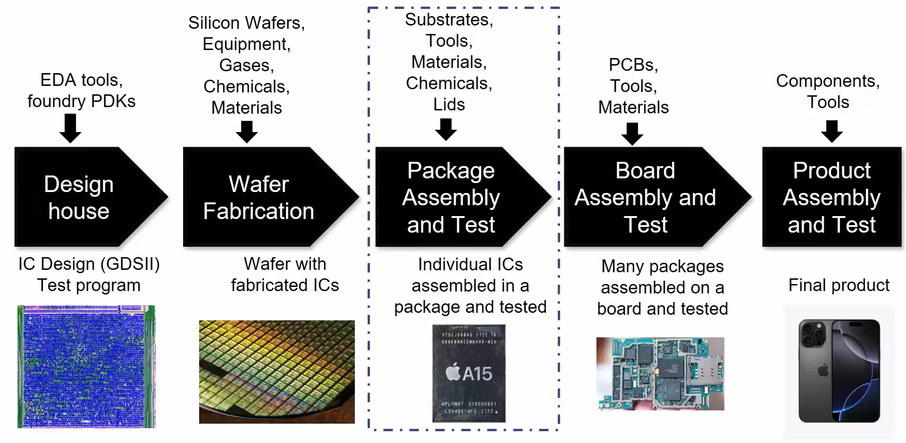
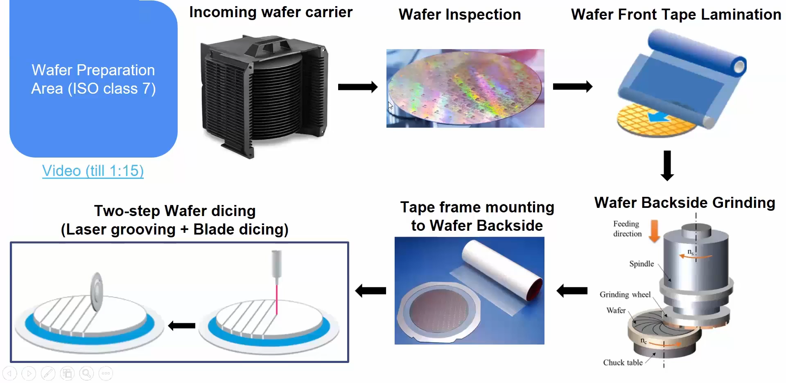
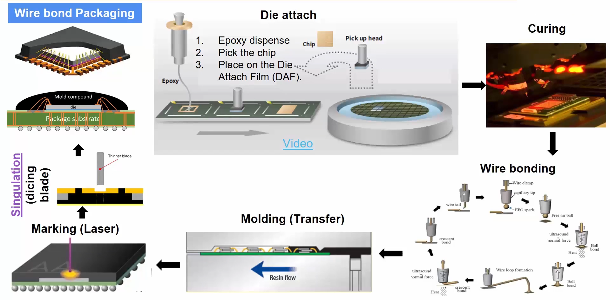
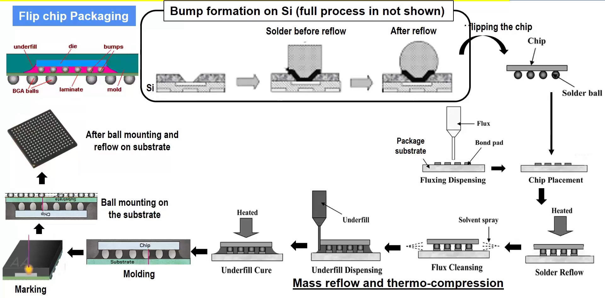
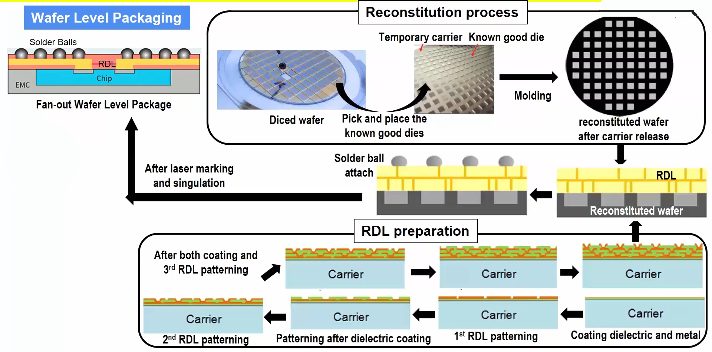

# Module 1: Evolution of Semiconductor Packaging – From Fundamentals to Advanced Integration

This module establishes a foundational understanding of semiconductor packaging, beginning with its essential role and progressing through technological advancements up to 3D integration.

## 1.1 Introduction to Packaging and Industry Landscape

Semiconductor packaging is the final step in device fabrication where a delicate silicon chip is encased within a structure that allows electrical interfacing and environmental protection. This stage transforms a bare die into a usable component for electronic systems.

**Core Functions of a Package:**

- **Protection**: Safeguards the chip against mechanical damage, contamination, humidity, corrosion, and electrostatic discharge.
- **Electrical Interface**: Provides a medium (e.g., pins, balls, or lands) to connect the die to the circuit board.
- **Structural Support**: Anchors the die physically within a larger electronic system.
- **Heat Dissipation**: Helps transfer heat away from the chip to maintain performance and prevent damage.

|  |
|:---:|

**Semiconductor Ecosystem Players:**

- **Fabless companies** (e.g., Apple, Qualcomm) design chips.
- **Foundries** (e.g., TSMC, GlobalFoundries) manufacture them.
- **OSATs** (Outsourced Semiconductor Assembly and Test) like ASE and Amkor handle packaging and testing.
- **IDMs** (Integrated Device Manufacturers) such as Intel manage everything from design to testing in-house.

|  |
|:---:|

## 1.2 Basic Package Needs and Common Architectures

Selecting a suitable package depends on several interlinked requirements:

**Package Selection Criteria:**

- **Application-Specific Needs**: E.g., logic vs. memory ICs, power chips.
- **Electrical Requirements**: Signal integrity, I/O count, power delivery capabilities.
- **Thermal Management**: Efficient heat removal, operating temperature range.
- **Form Factor**: Package size, height, system integration constraints.
- **Cost Efficiency**: Budget for both package production and system integration.
- **Durability**: Resistance to thermal cycling, mechanical shocks, moisture, and aging.

**Typical Package Layout:**

- **Die**: The actual chip.
- **Substrate/Carrier**: Mount for mechanical and electrical connection.
- **Bonding Elements**: Connect the die to the carrier using wires or bumps.
- **External Interfaces**: Allow attachment to the PCB.
- **Encapsulation**: A protective mold compound that shields internal parts.

**Mounting Styles:**

- **Through-Hole**: DIP, SIP, PGA
- **Surface Mount**: QFP, QFN, LGA, BGA
- **Advanced Types**: PoP, MCM, SiP, CoWoS

|  |
|:---:|

## 1.3 Evolution from Traditional to Complex Multi-Chip Architectures

Packaging technologies are generally divided into:

- **Conventional**: Packaging happens after wafer dicing.
- **Wafer-Level**: Packaging starts while dies are still on the wafer.

**Based on Carrier Medium:**

- **Leadframe Packages**: Simple structures like DIP, QFN.
- **Laminated Substrate Packages**: Complex routing support (e.g., PBGA, Flip-Chip PBGA).
- **Advanced Substrates**: Including 2.5D and interposer-based designs.

Each serves different markets and performance demands, from basic electronics to high-end HPC.

## 1.4 Advanced Interconnects: RDLs and Interposers

**Redistribution Layers (RDLs):**

- Metal layers rerouting I/O pads.
- Enables optimized bump layouts.
- Used in FO-WLP, PLP, and multi-die modules.

**Interposers:**

- Inserted between die and substrate.
- Enable high-density routing and better thermal/electrical performance.
- Types include silicon, organic, and glass.
- Can be passive (routing only) or active (include power management, logic).

**2.5D and 3D Approaches:**

- **2.5D**: Multiple dies mounted side-by-side on an interposer.
- **3D**: Dies stacked vertically using Through-Silicon Vias (TSVs).

|  |
|:---:|

## 1.5 Comparative Packaging Evaluation

This section helps assess package types based on:

- Performance
- Cost
- Area constraints
- Thermal characteristics
- Reliability

Choosing the optimal package involves trade-offs specific to the target application, system, and business case.

|  |
|:---:|

# Module 2: From Silicon Wafer to Complete Package – Assembly and Fabrication Processes

This module walks through the full manufacturing and packaging workflow, emphasizing the practical stages from wafer prep to packaging completion.

## 2.1 Overview of Supply Chain and Assembly Facilities

The journey from chip design to a packaged product spans multiple players:

- **Design House**: Engineers chip layouts using EDA tools and IPs.
- **Foundry**: Fabricates physical silicon using photolithography and etching.
- **Packaging and Test (ATMP)**: Dies are singulated, assembled into packages, and tested.
- **Board Assembly**: Packaged ICs are mounted on boards and validated.
- **System Integration**: Devices like smartphones, PCs, and servers are assembled.

|  |
|:---:|

**ATMP (Assembly, Test, Marking, Packaging) Facility Layout:**

- **Material Prep**: Wafer and component storage.
- **Cleanroom Processing**: Die attach, bonding, RDL formation, molding.
- **Testing Labs**: Electrical, burn-in, and reliability tests.
- **Warehousing**: Storage and shipping of finished ICs.

## 2.2 Wafer Preparation – Grinding and Dicing

Inside the ATMP cleanroom:

|  |
|:---:|

- **Incoming Inspection**: Wafers are examined for defects.
- **Protective Tape Lamination**: Applied to the front side for safety during grinding.
- **Back Grinding**: Wafer thickness is reduced for better thermal behavior.
- **Mounting on Ring Frame**: Stabilizes the wafer for precise cutting.

**Laser Grooving + Blade Dicing:**

- **Grooving**: Weakens die scribe lines.
- **Dicing**: Separates wafer into individual dies.

## 2.3 Wire Bond Assembly – Die to Molding Process

|  |
|:---:|

- **Die Attach**: Die is fixed to substrate with epoxy.
- **Epoxy Curing**: Ensures strong adhesion.
- **Wire Bonding**: Gold or aluminum wires connect die to substrate pads.
|  |
|:---:|

- **Encapsulation**: Mold compound protects the assembly.
- **Laser Marking**: Identification codes added.
- **Final Singulation**: Dicing separates finished packages.

## 2.4 Flip Chip Technology – Face-Down Die Integration

|  |
|:---:|

- **Solder Bump Formation**: On the die for pad connection.
- **Chip Flipping and Placement**: Die is inverted and aligned with the substrate.
- **Reflow Process**: Melts solder bumps to form joints.
- **Flux Removal**: Cleaning to avoid corrosion.
- **Underfill Application and Curing**: Enhances thermal and mechanical integrity.
- **Final Steps**: Mold compound, marking, ball mounting, and reflow for BGA.

## 2.5 Wafer-Level Packaging (WLP)

|  |
|:---:|

In WLP, the entire packaging is done before wafer dicing:

- **Fan-In WLP**: Bumps are within die footprint.
- **Fan-Out WLP (FO-WLP)**: Uses RDLs to expand the I/O area.

**FO-WLP Process Flow:**

|  |
|:---:|

- **Die Selection**: Only known-good dies are used.
- **Reconstitution**: Dies are placed on a carrier and molded.
- **RDL Layering**: Patterned on the reconstituted wafer.
- **Ball Attach and Singulation**: Final solder balls added and diced into individual packages.

# Module 3: Thermal Simulations of Semiconductor Packages Using ANSYS

### 3.1 - Introduction And Getting Started With ANSYS Electronics Desktop

ANSYS Electronics Desktop (AEDT) is a multi-physics simulation software that combines Electromagnetic, Signal Integrity, Thermal and Electro-Mechanical simulation tools in a single integrated platform. It is widely used for designing and analyzing high-speed electronic circuits and systems.

### 3.2 - Setting Up A Flip-Chip BGA Package

We will be taking an already available FC-BGA package within the Icepak Toolkit for this simulation exercise.

  - **Step 1 : Open AEDT and launch Icepak**

|  |
|:---|

  - **Step 2.1 : Create a Flipchip BGA Package**
    - `Icepak -> Toolkit -> Geometry -> Packages -> Flipchip_BGA`

|  |
|:---|

  - **Step 2.2 : The Package Configuration window opens up**
    - The dimensions and other aspects of the package, substrate, die, die underfill and the solder balls can be configured here.
    - Once configured, click OK to generate the package model. 

|  |  |
|:---|:---|
|  |  |

| Package generated in Icepak    |
|:---|

  - **Step 3 : Explore the 3D Package Model Structure in Icepak**

| **Ball Group**    | **Substrate**    |
|:---|:---|
| **Die Underfill**    | **Die**    |

### 3.3 - Material Definitions And Thermal Power Sources

  - **Step 4 : Review and modify the material and definition types for the different components of the model.**

| Material Definitions    |
|:---|

  - **Step 5.1 : Add/ Assign Source Thermal Model for Die**
    - In "Project Manager" sub-window, expand Thermal section and open the **_BGA1_die_source_** and configure the thermal condition as shown below:

| Source Thermal Model for Die    |
|:---|

- **Step 5.2 : Add/ Assign Source Thermal Model for Substrate**
    - To add a thermal boundary condition for the substrate, right click on **_Flipchip_BGA1_substrate_** under `Models -> Flipchip_BGA1_Group -> Solids` and assign a Thermal Source.
    - Set the thermal condition on the substrate to Fixed Temperatue and the temperature as Ambient.

| Add Source Thermal Model for Substrate    |  |
|:---|:---|

  - **Step 6 : Add Thermal monitors for the different components**
    - To add a Thermal monitor to the substrate, right click on the **_Flipchip_BGA1_substrate_** under `Models -> Flipchip_BGA1_Group -> Solids` and then choose `Assign Monitor -> Point...`
    - In the sub-window that appears, select **Temperature**
    - Repeat the same to add thermal monitors for the die and the die-underfill.

| Add Thermal monitor for Substrate    |  |
|:---|:---|

| Thermal monitors added    |
|:---|

### 3.4 - Meshing And Running The Thermal Analysis

  - **Step 7.1 : Generate Mesh**
    - Go to the Simulation tab and click on `Generate Mesh`
    - Save the project if prompted and wait for the mesh generation to get completed.
    - Take a note of any error(s) and warning(s) that are shown and ignore/ take steps to debug & fix the issue(s) as required.

  - **Step 7.2 : Review Mesh Quality metrics**
    - Once the mesh is generated, review the quality metrics of the generated mesh such as Face Alignment, Skewness and Volume.

| **Mesh Generation**    |
|:---|

| **Mesh Quality - Face Alignment**  | **Mesh Quality - Skewness**  |
|:---|:---|
| **Mesh Quality - Volume**  | |

  - **Step 8 : Add Thermal Analysis**
    - Under `Project Manager`, right click on `Analysis and then, select Add Analysis Setup` and configure the solver settings as required. (We will choose all default settings for our analysis)

| **Add Analysis Setup**    |
|:---|

### 3.5 - Viewing Results And Exploring Other Package Types

  - **Step 9 : Now, Validate the Simulation setup**
    - Click on the **Validate** button in the top ribbon
    - Ensure all checks are validated successfully

| **Validate the setup**    |
|:---|

  - **Step 10: Run the simulation and plot the temperature map**
    - Click on **Analyze All** button in the top ribbon
    - Wait for the simulation to get completed successfully. Take note of any warning(s) or errors that may need further debug or setup modification(s).
    - Once the simulation is completed, select the complete FC-BGA package in the 3D view by drawing a selection rectangle using the left-mouse button.
    - Right click and then select `Plot Fields -> Temperature -> Temperature`
    - Configure the different plot options:
      - Specify Name, Folder
      - Plot on Surface only
      - Surface Smoothing -> Enable Gaussian Smoothing

| **Plot Fields**  | **Field Plot Settings**  |
|:---|:---|
| **Field Plot - Top view**  | **Field Plot - Bottom view**  |

# Module 4: Ensuring Package Reliability – Testing and Performance Evaluation

This module focuses on the quality assurance and testing stages of semiconductor packaging, essential for identifying functional defects and validating long-term reliability.

## 4.1 Functional and Electrical Testing Overview

Testing is integrated at several stages in both the foundry and OSAT processes.

**Foundry-Side Testing**:

- **Wafer Probing**: Each die on a wafer is tested using a probe station before it is packaged. Dies are binned based on performance.

**OSAT-Side Testing**:

- **Assembly Open/Short Test (AOST)**: Detects electrical connectivity errors in packages.
- **Burn-In Test**: Devices are operated under high voltage and temperature for a prolonged time to weed out early-life failures.
- **Final Electrical Testing**: Ensures packaged chips operate across all specified voltage and temperature ranges.

**System-Level Testing (SLT)**:

This mimics real-world system environments by running firmware/software on the packaged device to catch system-level integration bugs.

## 4.2 Reliability and Stress Testing

This section details how ICs are evaluated under extreme conditions to guarantee robustness over time.

**Burn-In Test**:

- Simulates high-stress conditions to accelerate failure mechanisms.
- Helps eliminate weak units before shipping.

**Final Test (FT)**:

- Verifies the chip’s conformance to datasheet specs.
- Conducted after all packaging steps are complete.
- Often includes:
  - Voltage margin testing
  - Timing verification
  - Parametric tests

**Summary Table**: Illustrates where Automated Test Equipment (ATE) is used and the types of tests performed at each phase.

# Module 5: Package Design and Modeling: Building a Semiconductor Package from Scratch

This is a hands-on lab to design a semiconductor wire bond package from scratch using Ansys Electronics Desktop (AEDT). 

### 5.1 - Introduction to Package Cross-Section Modeling in ANSYS Electronics Desktop (AEDT)

The main focus of this lab exercise is to build the complete cross-section of a wire bond package, including die, substrate, bonding wires, and mold compound, rather than performing any simulation or analyses.

**<U>Package Specifications:</U>**
| Component | Properties |
|:---|:---|
| 1. Die | <ul> <li>Material : Silicon</li> <li>Dimensions : 3mm x 3mm</li> <li>Die Height : 200 micron</li> </ul> |
| 2. Substrate | <ul> <li>Material : FR4</li> <li>Dimensions : 5mm x 5mm</li> <li>Height : 500 micron</li> </ul> |
| 3. Die Attach | <ul> <li>Material : Modified Epoxy</li> <li>Dimensions : 3mm x 3mm</li> <li>Thickness : 100 micron</li> </ul> |
| 4. Die Bond Pads | <ul> <li>Material : Copper</li> <li>Dimensions : 0.2mm x 0.2mm</li> <li>Thickness : 5 micron</li> </ul> |
| 5. Substrate Bond Pads | <ul> <li>Material : Copper</li> <li>Dimensions : 0.2mm x 0.2mm</li> <li>Thickness : 10 micron</li> </ul> |
| 6. Bond Wire | <ul> <li>Material : Gold wire</li> <li>Type: JEDEC 4-point</li> </ul> |
| 7. Mold Compound | <ul> <li>Material : Epoxy</li> <li>Thickness : 1.2mm</li> </ul> |

  - **Step 1 : Launch AEDT and select Q3D (or Icepak, Maxwell 3D)**

|  |
|:---|

### 5.2 - Creating the Die and Substrate in AEDT

  - **Step 2 : Define the working unit**
    - `Modeler -> Units...`
    - Choose **mm** or **um** as the working unit for creating the model.

| Set working Units    |  |
|:---|:---|

  - **Step 3.1 : Create the Die Geometry**
    - Select the rectangle tool from the ribbon or using the Menus (`Draw -> Rectangle`) to draw a rectangle
    - Now, double click on **CreateRectangle** `Model -> Rectangle1` to open up its Properties Dialog box.
    - Specify the position with one corner at the origin (0, 0, 0) and the dimensions as 3mm x 3mm
    - Select `Model -> Rectangle1` and from the menu bar: `Modeler -> Surface -> Thicken Sheet...` and set the thickness to 200 microns (0.2mm)

  - **Step 3.2 : Assign Material Properties**
    - Open up the Properties Dialog box either by double clicking on `Model -> Rectangle1`
    - Rename the geometry to **Die**
    - Choose **Silicon** as the material from the Material Library.

| **Die Geometry**    | **Die Thickness**  |
|:---|:---|
| **Die Material**    |  |

  - **Step 4.1 : Create the Substrate Geometry**
    - Draw another rectangle for the substrate (5mm x 5mm) and position (-1, -1, 0) it such that the die is at the center.
    - Set the thickness as -500 microns (-0.5mm). Note the negative sign so as to have the substrate lie beneath the die.
    - Adjust the substrate position along Z-axis to account for the die attach thickness. **Adjusted position: (-1, -1, -0.1)**

| **Substrate Geometry**    | **Substrate Material**  |
|:---|:---|
| **Substrate position considering Die attach thickness**    |  |

### 5.3 - Adding Die Attach Material and Bond Pads

  - **Step 5 : Create the Die Attach Material**
    - Draw a rectangle of the same size as that of the die (3mm x 3mm) and at the same co-ordinates (0, 0, 0).
    - Set the thickness to -100 microns (-0.1mm) as the DAM lies beneath the die and the substrate
    - Assign the material to _**Modified Eopxy**_
    - **NOTE:** Assign different shades/ colours to adjacent components to easily discern in 3D view.

| **Die Attach Material**    | **Geometry**  |
|:---|:---|
| **Material**    |  |

  - **Step 6 : Create Bond pads on Die and Substrate**
  - Draw a small rectangle and configure its size to to that of the die pad (0.2mm x 0.2mm). We will place the first Die Pad at the co-ordinates (0.2, 0.2, 0.2) so that it sits on top of the die and is at one of the edges.
  - Set the thickness to 5 microns (0.005mm)

| **Die Bond Pad**    |
|:---|

  - Similarly, draw a small rectangle and configure its size to to that of the substrate bond pad (0.2mm x 0.2mm).
  - We will place this Substrate Bind Pad at the co-ordinates (0.2, -0.7, -0.1) so that it sits aligned to the Die bond pad created in the previous step, and also on top of the substrate.
  - Set the substrate bond pad thickness to 10 microns (0.010mm)

| **Substrate Bond Pad**    |
|:---|

### 5.4 - Wire Bond Creation and Material Assignment

  - **Step 7 : Create Bond Wires**
    - Use the **Bondwire tool** under: `Draw -> Bondwire`
    - Connect the centre of the Die Bond pad to the centre of the Substrate Bond Pad. It might be easier to draw the wires from the Top view orientation.
    - Select the Bondwire type as JEDEC 4-point
    - Assign gold as the Bondwire material

| **Draw the Bondwire connecting the die & substrate pad centers**    |  |
|:---|:---|
| **Gold Bondwire**    |  |

Now, repeat the steps 6 and 7 to create and connect all the die and substrate bond pads using bondwires.

### 5.5 - Applying Mold Compound and Finalizing the Package Model

  - **Step 8 : Build the mold compound around the die**
    - Create a rectangular enclosure around the die and wires (5mm x 5mm, 1.2mm thickness)
    - Position at (-1, -1, -0.1) covering the top side of the substrate.
    - Set the thickness to 1.2mm so that it covers the die and the bondwires, while also leaving margin for any laser marking processes

| **Mold**    |  |
|:---|:---|

